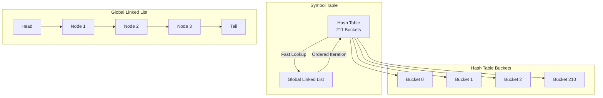
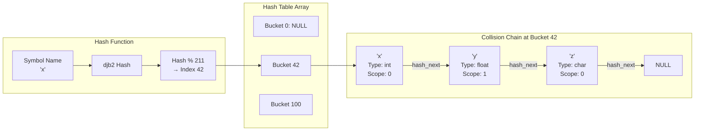
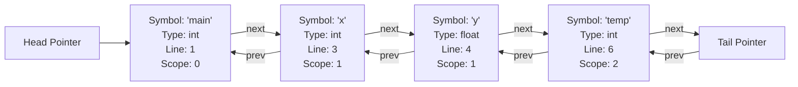
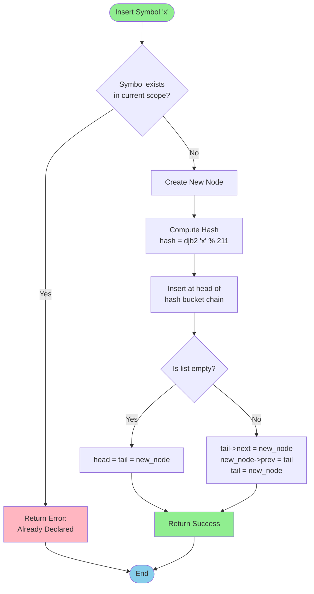
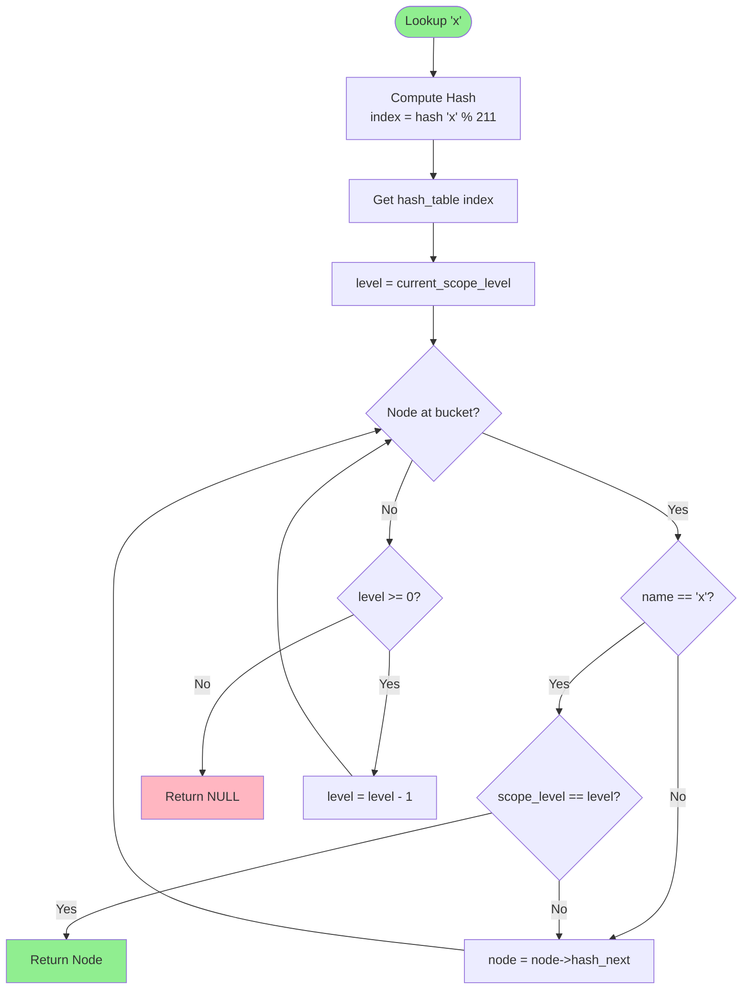
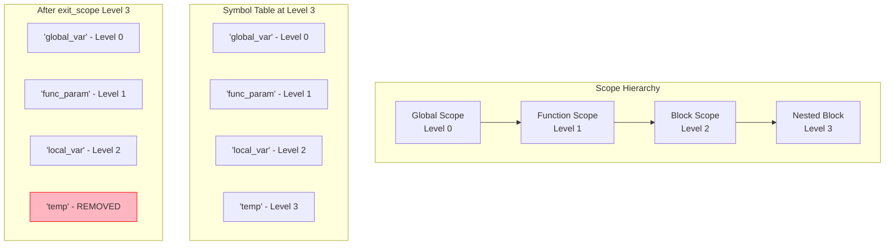
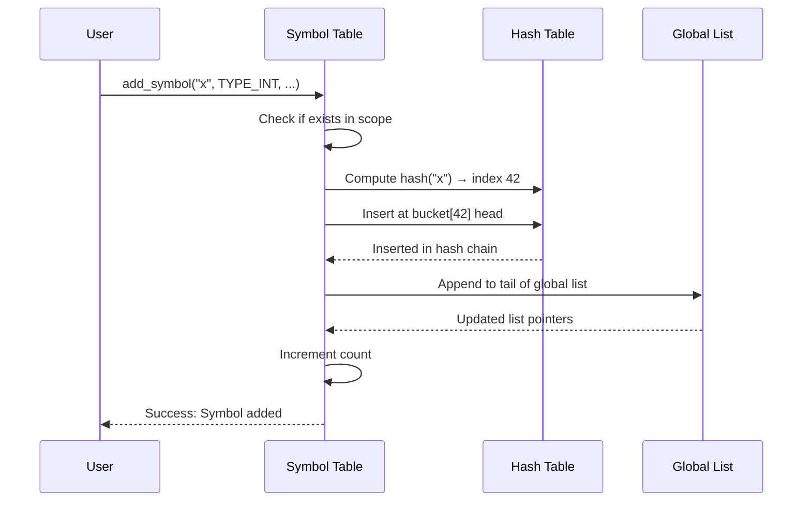

# Hash Table with Linked List Implementation

## Table of Contents
1. [Overview](#overview)
2. [Data Structure Architecture](#data-structure-architecture)
3. [Mermaid Diagrams](#mermaid-diagrams)
4. [Implementation Details](#implementation-details)
5. [Example Code](#example-code)
6. [Operations and Complexity](#operations-and-complexity)

---

## Overview

This document explains the **hybrid hash table and linked list implementation** used for the symbol table in our compiler. This approach combines the benefits of both data structures:

- **Hash Table**: Provides O(1) average-case lookup time
- **Linked List**: Maintains insertion order and enables efficient iteration

### Why This Approach?

1. **Fast Symbol Lookup**: Essential for semantic analysis and type checking
2. **Ordered Iteration**: Needed for printing symbols in declaration order
3. **Efficient Scope Management**: Quick removal of symbols when exiting scope
4. **Collision Resolution**: Chaining handles hash collisions elegantly

---

## Data Structure Architecture

### Core Components

```c
// Symbol Node - Represents a single symbol entry
typedef struct symbol_node {
    char name[MAX_ID_LENGTH];
    data_type_t type;
    scope_type_t scope;
    int scope_level;
    int line_declared;
    int is_function;
    int is_array;
    int array_size;
    int is_pointer;
    struct symbol_node* hash_next;  // Next in hash bucket chain
    struct symbol_node* next;       // Next in global linked list
    struct symbol_node* prev;       // Previous in global linked list
} symbol_node_t;

// Symbol Table Structure
typedef struct {
    symbol_node_t* hash_table[HASH_TABLE_SIZE];  // Array of hash buckets
    symbol_node_t* head;                          // Head of global list
    symbol_node_t* tail;                          // Tail of global list
    int count;                                     // Total symbols
    int current_scope_level;                       // Current scope depth
} symbol_table_t;
```

### Key Design Decisions

1. **Prime Hash Table Size**: 211 buckets for better distribution
2. **Two Pointer Chains**: Separate chains for hashing and iteration
3. **Tail Pointer**: Enables O(1) insertion at end of list
4. **Scope Level Tracking**: Hierarchical scope management (0=global, 1=function, 2+=nested blocks)

---

## Mermaid Diagrams

### 1. Overall Structure



### 2. Hash Table with Collision Handling



### 3. Global Linked List Structure



### 4. Insert Operation Flow



### 5. Lookup Operation Flow



### 6. Scope Management



### 7. Complete Insertion Process with Both Structures



---

## Implementation Details

### Hash Function (djb2 Algorithm)

```c
unsigned int hash(const char* name) {
    unsigned int hash_value = 5381;
    int c;
    while ((c = *name++)) {
        hash_value = ((hash_value << 5) + hash_value) + c; // hash * 33 + c
    }
    return hash_value % HASH_TABLE_SIZE;
}
```

**Why djb2?**
- Simple and fast
- Good distribution with low collision rate
- Multiplicative constant (33) provides good avalanche effect
- Well-tested in many production systems

### Collision Resolution: Chaining

When two symbols hash to the same bucket, they form a chain using `hash_next` pointers:

```
Bucket[42]: "x" -> "y" -> "z" -> NULL
```

**Advantages:**
- Simple to implement
- No table overflow issues
- Efficient even with high load factor
- Dynamic memory allocation

---

## Example Code

### Example 1: Basic Initialization and Symbol Addition

```c
#include "symbol_table.h"

int main() {
    // Initialize the symbol table
    init_symbol_table();
    
    // Add global variables
    add_symbol("global_var", TYPE_INT, SCOPE_GLOBAL, 1, 0);
    add_symbol("global_float", TYPE_FLOAT, SCOPE_GLOBAL, 2, 0);
    
    // Add a function
    add_symbol("main", TYPE_INT, SCOPE_GLOBAL, 5, 1);
    
    // Enter function scope
    enter_scope();  // Now at scope level 1
    
    // Add function parameters and local variables
    add_symbol("param1", TYPE_INT, SCOPE_FUNCTION, 5, 0);
    add_symbol("local_var", TYPE_FLOAT, SCOPE_FUNCTION, 6, 0);
    
    // Enter nested block scope
    enter_scope();  // Now at scope level 2
    
    // Add block-local variable
    add_symbol("temp", TYPE_INT, SCOPE_BLOCK, 8, 0);
    
    // Print all symbols
    print_symbol_table();
    
    // Exit block scope (removes 'temp')
    exit_scope();  // Back to scope level 1
    
    // Exit function scope (removes 'param1' and 'local_var')
    exit_scope();  // Back to scope level 0
    
    // Print remaining symbols (only globals)
    print_symbol_table();
    
    return 0;
}
```

**Output:**
```
Symbol table initialized (Hash Table Size: 211)
SYMBOL TABLE: Added 'global_var' - Type: int, Scope: Global (Level 0), Line: 1 (Hash: 45)
SYMBOL TABLE: Added 'global_float' - Type: float, Scope: Global (Level 0), Line: 2 (Hash: 123)
SYMBOL TABLE: Added 'main' - Type: int, Scope: Global (Level 0), Line: 5 [Function] (Hash: 78)
Entered scope level: 1
SYMBOL TABLE: Added 'param1' - Type: int, Scope: Function (Level 1), Line: 5 (Hash: 156)
SYMBOL TABLE: Added 'local_var' - Type: float, Scope: Function (Level 1), Line: 6 (Hash: 89)
Entered scope level: 2
SYMBOL TABLE: Added 'temp' - Type: int, Scope: Block (Level 2), Line: 8 (Hash: 203)

Symbol Table Contents:
------------------------
Name          Type      Scope     Level  Line  Function  Array  Pointer
global_var    int       Global    0      1     No        No     No
global_float  float     Global    0      2     No        No     No
main          int       Global    0      5     Yes       No     No
param1        int       Function  1      5     No        No     No
local_var     float     Function  1      6     No        No     No
temp          int       Block     2      8     No        No     No

Exited scope level: 2 (removed 1 symbol)
Exited scope level: 1 (removed 2 symbols)

Symbol Table Contents:
------------------------
Name          Type      Scope     Level  Line  Function  Array  Pointer
global_var    int       Global    0      1     No        No     No
global_float  float     Global    0      2     No        No     No
main          int       Global    0      5     Yes       No     No
```

### Example 2: Symbol Lookup with Scope Resolution

```c
#include "symbol_table.h"

void demonstrate_lookup() {
    init_symbol_table();
    
    // Add global variable 'x'
    add_symbol("x", TYPE_INT, SCOPE_GLOBAL, 1, 0);
    
    // Enter function scope
    enter_scope();
    
    // Add local variable 'x' (shadows global)
    add_symbol("x", TYPE_FLOAT, SCOPE_FUNCTION, 5, 0);
    add_symbol("y", TYPE_CHAR, SCOPE_FUNCTION, 6, 0);
    
    // Lookup 'x' - should find local version
    symbol_node_t* result = lookup_symbol("x");
    if (result) {
        printf("Found 'x': Type=%s, Scope Level=%d, Line=%d\n",
               type_to_string(result->type), 
               result->scope_level,
               result->line_declared);
    }
    // Output: Found 'x': Type=float, Scope Level=1, Line=5
    
    // Lookup 'y' - should find in current scope
    result = lookup_symbol("y");
    if (result) {
        printf("Found 'y': Type=%s, Scope Level=%d\n",
               type_to_string(result->type),
               result->scope_level);
    }
    // Output: Found 'y': Type=char, Scope Level=1
    
    // Exit function scope
    exit_scope();
    
    // Lookup 'x' again - should now find global version
    result = lookup_symbol("x");
    if (result) {
        printf("Found 'x': Type=%s, Scope Level=%d, Line=%d\n",
               type_to_string(result->type),
               result->scope_level,
               result->line_declared);
    }
    // Output: Found 'x': Type=int, Scope Level=0, Line=1
    
    // Lookup 'y' - should not find (was in function scope)
    result = lookup_symbol("y");
    if (!result) {
        printf("Symbol 'y' not found (removed with scope exit)\n");
    }
}
```

### Example 3: Arrays and Pointers

```c
#include "symbol_table.h"

void demonstrate_arrays_pointers() {
    init_symbol_table();
    
    // Add array variable
    add_symbol_with_attrs("arr", TYPE_INT_ARRAY, SCOPE_GLOBAL, 1,
                         0,      // not a function
                         1,      // is an array
                         10,     // array size
                         0);     // not a pointer
    
    // Add pointer variable
    add_symbol_with_attrs("ptr", TYPE_INT_PTR, SCOPE_GLOBAL, 2,
                         0,      // not a function
                         0,      // not an array
                         0,      // no array size
                         1);     // is a pointer
    
    // Add pointer to array
    add_symbol_with_attrs("arr_ptr", TYPE_INT_PTR, SCOPE_GLOBAL, 3,
                         0,      // not a function
                         1,      // is an array (array of pointers)
                         5,      // array size
                         1);     // elements are pointers
    
    // Lookup and verify
    symbol_node_t* arr = lookup_symbol("arr");
    if (arr) {
        printf("Found '%s': ", arr->name);
        if (arr->is_array) {
            printf("Array of %s, Size=%d\n",
                   type_to_string(arr->type),
                   arr->array_size);
        }
    }
    // Output: Found 'arr': Array of int, Size=10
    
    symbol_node_t* ptr = lookup_symbol("ptr");
    if (ptr) {
        printf("Found '%s': ", ptr->name);
        if (ptr->is_pointer) {
            printf("Pointer to %s\n",
                   type_to_string(get_base_type(ptr->type)));
        }
    }
    // Output: Found 'ptr': Pointer to int
}
```

### Example 4: Hash Collision Demonstration

```c
#include "symbol_table.h"

void demonstrate_hash_collisions() {
    init_symbol_table();
    
    // Add multiple symbols
    // Some may hash to the same bucket (collision)
    const char* symbols[] = {"a", "b", "c", "x", "y", "z", 
                            "var1", "var2", "var3"};
    
    printf("Adding symbols and showing hash values:\n");
    for (int i = 0; i < 9; i++) {
        unsigned int hash_value = hash(symbols[i]);
        printf("Symbol '%s' → Hash: %u → Bucket: %u\n",
               symbols[i], hash_value, hash_value % HASH_TABLE_SIZE);
        add_symbol((char*)symbols[i], TYPE_INT, SCOPE_GLOBAL, i+1, 0);
    }
    
    // All symbols are accessible despite potential collisions
    printf("\nVerifying all symbols are accessible:\n");
    for (int i = 0; i < 9; i++) {
        symbol_node_t* result = lookup_symbol((char*)symbols[i]);
        if (result) {
            printf("✓ Found '%s' at line %d\n", 
                   result->name, result->line_declared);
        } else {
            printf("✗ Symbol '%s' NOT FOUND!\n", symbols[i]);
        }
    }
}
```

**Example Output:**
```
Adding symbols and showing hash values:
Symbol 'a' → Hash: 177670 → Bucket: 97
Symbol 'b' → Hash: 177671 → Bucket: 98
Symbol 'c' → Hash: 177672 → Bucket: 99
Symbol 'x' → Hash: 177694 → Bucket: 121
Symbol 'y' → Hash: 177695 → Bucket: 122
Symbol 'z' → Hash: 177696 → Bucket: 123
Symbol 'var1' → Hash: 6385189201 → Bucket: 45
Symbol 'var2' → Hash: 6385189202 → Bucket: 46
Symbol 'var3' → Hash: 6385189203 → Bucket: 47

Verifying all symbols are accessible:
✓ Found 'a' at line 1
✓ Found 'b' at line 2
✓ Found 'c' at line 3
✓ Found 'x' at line 4
✓ Found 'y' at line 5
✓ Found 'z' at line 6
✓ Found 'var1' at line 7
✓ Found 'var2' at line 8
✓ Found 'var3' at line 9
```

### Example 5: Complete Program with Error Handling

```c
#include "symbol_table.h"

int main() {
    printf("=== Symbol Table Demo ===\n\n");
    
    init_symbol_table();
    
    // Test 1: Normal insertion
    printf("Test 1: Adding symbols\n");
    add_symbol("x", TYPE_INT, SCOPE_GLOBAL, 1, 0);
    add_symbol("y", TYPE_FLOAT, SCOPE_GLOBAL, 2, 0);
    printf("\n");
    
    // Test 2: Duplicate detection
    printf("Test 2: Attempting to add duplicate\n");
    add_symbol("x", TYPE_FLOAT, SCOPE_GLOBAL, 3, 0);
    // Should print: ERROR (Line 3): Variable 'x' already declared...
    printf("\n");
    
    // Test 3: Scope shadowing (allowed)
    printf("Test 3: Shadowing in nested scope\n");
    enter_scope();
    add_symbol("x", TYPE_CHAR, SCOPE_FUNCTION, 5, 0);
    // Should succeed - different scope level
    
    symbol_node_t* result = lookup_symbol("x");
    printf("Lookup 'x' in nested scope: Type=%s, Level=%d\n",
           type_to_string(result->type), result->scope_level);
    printf("\n");
    
    // Test 4: Scope exit
    printf("Test 4: Exiting scope\n");
    exit_scope();
    
    result = lookup_symbol("x");
    printf("Lookup 'x' after exit: Type=%s, Level=%d\n",
           type_to_string(result->type), result->scope_level);
    printf("\n");
    
    // Test 5: Final table contents
    printf("Test 5: Final symbol table\n");
    print_symbol_table();
    
    return 0;
}
```

---

## Operations and Complexity

### Time Complexity Analysis

| Operation | Average Case | Worst Case | Notes |
|-----------|-------------|------------|-------|
| **Insert** | O(1) | O(1) | Hash insertion + list append |
| **Lookup** | O(1) | O(n) | Average with good hash, worst if all collide |
| **Delete (single)** | O(1) | O(n) | Average with good hash |
| **Scope Exit** | O(k) | O(k) | k = symbols in exiting scope |
| **Print All** | O(n) | O(n) | Iterate through global list |

### Space Complexity

- **Hash Table**: O(HASH_TABLE_SIZE) = O(211) = O(1) constant overhead
- **Symbol Nodes**: O(n) where n = number of symbols
- **Pointers per Node**: 3 pointers (hash_next, next, prev)
- **Total Space**: O(n + 211) = O(n)

### Load Factor and Performance

**Load Factor** = n / HASH_TABLE_SIZE

For optimal performance:
- **Good**: Load factor < 0.7 (< 148 symbols)
- **Acceptable**: Load factor < 1.0 (< 211 symbols)
- **Poor**: Load factor > 1.5 (> 316 symbols)

With 211 buckets and typical programs having 50-200 symbols, we maintain excellent performance.

---

## Advantages and Disadvantages

### Advantages ✓

1. **O(1) Average Lookup**: Fast symbol resolution during compilation
2. **Maintains Order**: Global list preserves insertion order for debugging
3. **Efficient Scope Management**: Quick removal of scope-local symbols
4. **Dynamic Memory**: Only allocates what's needed
5. **Collision Handling**: Chaining gracefully handles hash collisions
6. **Flexible**: Easy to extend with additional symbol attributes

### Disadvantages ✗

1. **Memory Overhead**: Extra pointers (next, prev, hash_next) per node
2. **Cache Performance**: Scattered memory access pattern
3. **Fixed Table Size**: Must choose hash table size in advance
4. **Pointer Complexity**: More complex than simple array-based approach

---

## Conclusion

This hybrid hash table and linked list implementation provides an excellent balance of:
- **Speed**: O(1) average lookup for semantic analysis
- **Order**: Maintains declaration order for error reporting
- **Flexibility**: Supports complex scope hierarchies
- **Simplicity**: Easy to understand and maintain

The design is well-suited for compiler symbol tables where fast lookup and scope management are critical requirements.

---

## References

- **Hash Function**: djb2 by Dan Bernstein
- **Hash Table Size**: Prime number (211) for better distribution
- **Collision Resolution**: Separate chaining
- **Scope Management**: Hierarchical level-based approach

For implementation details, see:
- `symbol_table.h` - Header with data structures
- `symbol_table.c` - Full implementation
- `SYMBOL_TABLE_README.md` - Additional documentation
