# Symbol Table Implementation - Line by Line Explanation

## Table of Contents
1. [Overview](#overview)
2. [Header File Analysis](#header-file-analysis)
3. [Implementation File Analysis](#implementation-file-analysis)
4. [Key Algorithms](#key-algorithms)
5. [Examples and Use Cases](#examples-and-use-cases)

---

## Overview

This symbol table implementation uses a **hybrid data structure** combining:
- **Hash Table**: For O(1) average-case symbol lookup
- **Doubly-Linked List**: For maintaining insertion order and easy iteration

This design provides both fast access and the ability to traverse symbols in order.

### High-Level Architecture

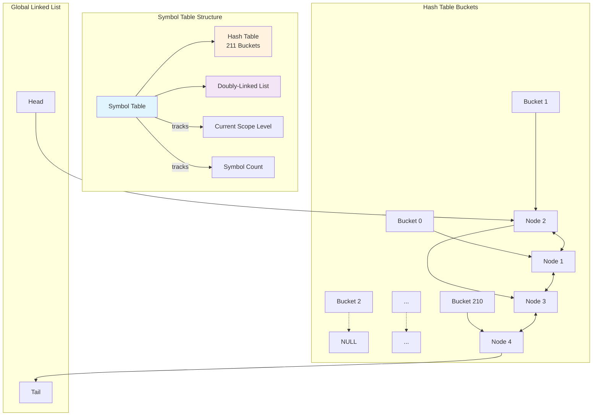

---

## Header File Analysis

### Data Type Enumeration

```c
typedef enum {
    TYPE_INT,          // Integer type
    TYPE_FLOAT,        // Floating-point type
    TYPE_CHAR,         // Character type
    TYPE_VOID,         // Void type (for functions)
    TYPE_UNKNOWN,      // Unknown/uninitialized type
    TYPE_INT_PTR,      // Pointer to int
    TYPE_FLOAT_PTR,    // Pointer to float
    TYPE_CHAR_PTR,     // Pointer to char
    TYPE_INT_ARRAY,    // Array of int
    TYPE_FLOAT_ARRAY,  // Array of float
    TYPE_CHAR_ARRAY    // Array of char
} data_type_t;
```

**Purpose**: Enumerates all possible data types in the language.
- Basic types: `int`, `float`, `char`, `void`
- Pointer types: Distinguished from base types for type checking
- Array types: Separate from pointers (different semantics)

### Scope Type Enumeration

```c
typedef enum {
    SCOPE_GLOBAL,      // Global scope (file level)
    SCOPE_FUNCTION,    // Function parameter/local scope
    SCOPE_BLOCK        // Block scope (if/while/for blocks)
} scope_type_t;
```

**Purpose**: Represents the scope category of a symbol.
- Used for semantic analysis and scope resolution
- Helps determine symbol visibility

### Symbol Node Structure

```c
typedef struct symbol_node {
    char name[MAX_ID_LENGTH];           // Symbol name (max 32 chars)
    data_type_t type;                   // Data type of the symbol
    scope_type_t scope;                 // Scope category
    int scope_level;                    // Numeric scope depth (0=global)
    int line_declared;                  // Line number where declared
    int is_function;                    // 1 if function, 0 if variable
    int is_array;                       // 1 if array, 0 otherwise
    int array_size;                     // Size of array (0 if not array)
    int is_pointer;                     // 1 if pointer, 0 otherwise
    struct symbol_node* hash_next;      // Next in hash bucket chain
    struct symbol_node* next;           // Next in global linked list
    struct symbol_node* prev;           // Previous in global linked list
} symbol_node_t;
```

**Key Fields Explained**:

1. **`name[MAX_ID_LENGTH]`**: 
   - Fixed-size array for symbol name
   - Avoids dynamic allocation for small strings
   - MAX_ID_LENGTH = 32 characters

2. **`scope_level`**: 
   - Numeric depth (0 = global, 1+ = nested)
   - Different from `scope` (which is category)
   - Example: `{ { int x; } }` - x has scope_level = 2

3. **`hash_next`**: 
   - Points to next symbol in **same hash bucket**
   - Used for collision resolution (chaining)
   - NULL if no collision

4. **`next` / `prev`**: 
   - Points to adjacent symbols in **global list**
   - Maintains insertion order across all buckets
   - Used for printing/iteration

**Why Two Linked Structures?**
- Hash chains: Fast lookup by name
- Global list: Ordered traversal for printing/scope exit

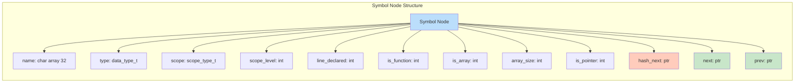

### Symbol Table Structure

```c
typedef struct {
    symbol_node_t* hash_table[HASH_TABLE_SIZE];  // Array of bucket heads
    symbol_node_t* head;                          // First symbol overall
    symbol_node_t* tail;                          // Last symbol overall
    int count;                                     // Total symbols
    int current_scope_level;                       // Active scope depth
} symbol_table_t;
```

**Structure Breakdown**:

1. **`hash_table[HASH_TABLE_SIZE]`**:
   - Array of 211 pointers (prime number)
   - Each pointer is head of a chain (collision list)
   - Initially all NULL

2. **`head` / `tail`**:
   - Doubly-linked list spanning ALL symbols
   - Independent of hash table structure
   - Enables in-order traversal

3. **`current_scope_level`**:
   - Tracks nesting depth
   - Incremented on `{`, decremented on `}`
   - Used for scope resolution

**Visual Representation**:

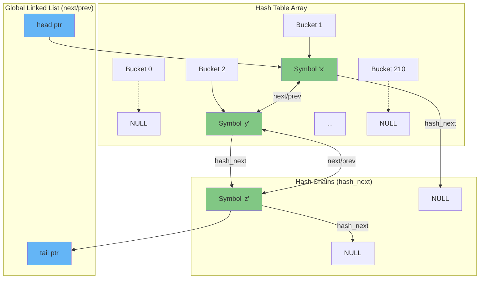

---

## Implementation File Analysis

### Global Variables

```c
symbol_table_t sym_table;
int current_scope = 0;
```

**Line-by-line**:
- `symbol_table_t sym_table`: **Global instance** of the symbol table
  - Accessible throughout the compilation
  - Single source of truth for all symbols
  
- `int current_scope = 0`: **Legacy variable** (seems unused in favor of `sym_table.current_scope_level`)
  - Kept for backward compatibility

---

### Hash Function

```c
unsigned int hash(const char* name) {
    unsigned int hash_value = 5381;           // Line 1: Initialize seed
    int c;                                     // Line 2: Character buffer
    while ((c = *name++)) {                   // Line 3: Read each character
        hash_value = ((hash_value << 5) + hash_value) + c; // Line 4: DJB2 algorithm
    }
    return hash_value % HASH_TABLE_SIZE;      // Line 5: Map to table size
}
```

**Detailed Explanation**:

**Line 1**: `unsigned int hash_value = 5381;`
- **Magic number 5381**: Starting seed for DJB2 algorithm
- Created by Dan Bernstein, empirically proven to distribute well
- Unsigned to avoid overflow issues

**Line 3**: `while ((c = *name++))`
- Reads character at current position and advances pointer
- Stops at null terminator (0 = false)
- Compact C idiom: combines read + increment + check

**Line 4**: `hash_value = ((hash_value << 5) + hash_value) + c;`
- `hash_value << 5`: Left shift by 5 = multiply by 32
- `+ hash_value`: Total = `hash * 33`
- `+ c`: Add ASCII value of character
- **Formula**: `hash = hash * 33 + c`
- Why 33? Empirically good distribution, fast computation

**Line 5**: `return hash_value % HASH_TABLE_SIZE;`
- Maps hash to valid bucket index [0, 210]
- Modulo by prime (211) reduces clustering
- Ensures index is always valid

**Example**:
```
Input: "var"
Step 1: hash = 5381
Step 2: hash = 5381 * 33 + 'v'(118) = 177691
Step 3: hash = 177691 * 33 + 'a'(97) = 5863900
Step 4: hash = 5863900 * 33 + 'r'(114) = 193508814
Step 5: return 193508814 % 211 = 134

Result: "var" goes into bucket 134
```

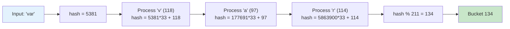

---

### Initialize Symbol Table

```c
void init_symbol_table() {
    // Initialize hash table buckets to NULL
    for (int i = 0; i < HASH_TABLE_SIZE; i++) {     // Line 1
        sym_table.hash_table[i] = NULL;             // Line 2
    }
    
    sym_table.head = NULL;                          // Line 3
    sym_table.tail = NULL;                          // Line 4
    sym_table.count = 0;                            // Line 5
    sym_table.current_scope_level = 0;              // Line 6
    printf("Symbol table initialized (Hash Table Size: %d)\n", HASH_TABLE_SIZE);
}
```

**Purpose**: Prepare symbol table for first use.

**Line 1-2**: Initialize hash table
- Sets all 211 bucket heads to NULL
- Indicates empty buckets (no collisions yet)

**Line 3-4**: Initialize linked list
- `head = NULL`: No first symbol
- `tail = NULL`: No last symbol
- Empty list ready for insertions

**Line 5**: `sym_table.count = 0;`
- Track total symbols across all scopes
- Used for statistics and validation

**Line 6**: `sym_table.current_scope_level = 0;`
- Start at global scope (depth 0)
- Will increment/decrement with scope changes

---

### Add Symbol (Simple Version)

```c
int add_symbol(char* name, data_type_t type, scope_type_t scope, int line_no, int is_function) {
    return add_symbol_with_attrs(name, type, scope, line_no, is_function, 0, 0, 0);
}
```

**Purpose**: Wrapper function for backward compatibility.
- Calls full version with default values:
  - `is_array = 0`: Not an array
  - `array_size = 0`: No size
  - `is_pointer = 0`: Not a pointer
- Simplifies calls when additional attributes aren't needed

---

### Add Symbol (Full Version)

This is the **most important function**. Let's analyze it in detail:

```c
int add_symbol_with_attrs(char* name, data_type_t type, scope_type_t scope, int line_no, 
                          int is_function, int is_array, int array_size, int is_pointer) {
```

**Parameters**:
- `name`: Identifier name (e.g., "x", "myFunc")
- `type`: Data type enum value
- `scope`: Scope category enum
- `line_no`: Source line number (for error messages)
- `is_function`: Boolean flag
- `is_array`: Boolean flag for arrays
- `array_size`: Size if array (0 if unknown/not array)
- `is_pointer`: Boolean flag for pointers

**Return**: `1` on success, `0` on failure (duplicate symbol)

#### Step 1: Check for Duplicates

```c
    // Check if symbol already exists in current scope
    symbol_node_t* existing = lookup_symbol_in_scope(name, sym_table.current_scope_level);
    if (existing != NULL) {
        printf("ERROR (Line %d): Variable '%s' already declared in current scope (previously declared at line %d)\n", 
               line_no, name, existing->line_declared);
        return 0;
    }
```

**Why check current scope only?**
- C allows **shadowing**: inner scope can redeclare outer scope variables
- Example: Legal in C:
  ```c
  int x = 5;      // Global x
  {
      int x = 10; // Different x (shadows global)
  }
  ```
- Illegal: Two declarations in **same** scope
  ```c
  int x = 5;
  int x = 10;     // ERROR!
  ```

**Error Reporting**:
- Reports line of duplicate declaration
- Reports line of original declaration
- Helps programmer locate both occurrences

#### Step 2: Allocate Memory

```c
    // Create new symbol node
    symbol_node_t* new_node = (symbol_node_t*)malloc(sizeof(symbol_node_t));
    if (new_node == NULL) {
        printf("ERROR: Memory allocation failed for symbol '%s'\n", name);
        return 0;
    }
```

**Memory Management**:
- Allocates heap memory for new symbol
- Size: `sizeof(symbol_node_t)` bytes (~100 bytes)
- **Error checking**: If malloc fails (rare), report and abort
- Memory persists until `exit_scope()` or program end

#### Step 3: Fill Symbol Information

```c
    // Fill in symbol information
    strncpy(new_node->name, name, MAX_ID_LENGTH - 1);
    new_node->name[MAX_ID_LENGTH - 1] = '\0';
    new_node->type = type;
    new_node->scope = scope;
    new_node->scope_level = sym_table.current_scope_level;
    new_node->line_declared = line_no;
    new_node->is_function = is_function;
    new_node->is_array = is_array;
    new_node->array_size = array_size;
    new_node->is_pointer = is_pointer;
    new_node->hash_next = NULL;
    new_node->next = NULL;
    new_node->prev = NULL;
```

**Line-by-line**:

1. **`strncpy(new_node->name, name, MAX_ID_LENGTH - 1);`**
   - Copy at most 31 characters (leaving room for '\0')
   - Safer than `strcpy` (prevents buffer overflow)
   - If name > 31 chars, truncates

2. **`new_node->name[MAX_ID_LENGTH - 1] = '\0';`**
   - **Critical**: Ensures null termination
   - `strncpy` doesn't add '\0' if string is truncated
   - Prevents undefined behavior in string operations

3. **Copy all attributes**: Self-explanatory direct assignments

4. **Initialize pointers to NULL**:
   - `hash_next = NULL`: Not yet in hash chain
   - `next = NULL`: Not yet in linked list
   - `prev = NULL`: Not yet in linked list
   - Will be set in next steps

#### Step 4: Insert into Hash Table

```c
    // Insert into hash table for fast lookup
    unsigned int hash_index = hash(name);
    new_node->hash_next = sym_table.hash_table[hash_index];
    sym_table.hash_table[hash_index] = new_node;
```

**Algorithm**: Insert at head of hash chain (O(1))

**Visual Example**:

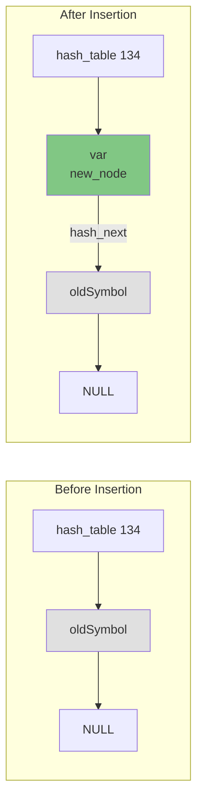

**Step-by-step**:
1. `hash_index = hash(name)`: Get bucket (0-210)
2. `new_node->hash_next = sym_table.hash_table[hash_index]`: 
   - Point new node to current bucket head
   - Could be NULL (empty bucket) or existing node (collision)
3. `sym_table.hash_table[hash_index] = new_node`:
   - Make new node the new bucket head
   - **Prepending** (faster than appending)

#### Step 5: Insert into Global Linked List

```c
    // Also maintain a global linked list for iteration/printing
    if (sym_table.head == NULL) {
        sym_table.head = new_node;
        sym_table.tail = new_node;
    } else {
        sym_table.tail->next = new_node;
        new_node->prev = sym_table.tail;
        sym_table.tail = new_node;
    }
```

**Two Cases**:

**Case 1: First symbol ever** (`head == NULL`)

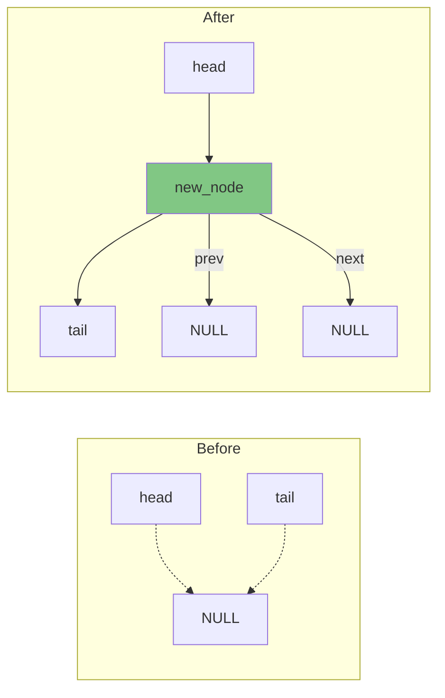

- Both head and tail point to same node
- `next` and `prev` are NULL (only node)

**Case 2: Append to existing list** (`head != NULL`)

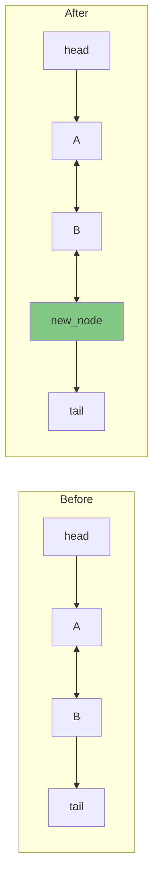

- `sym_table.tail->next = new_node`: Link old tail forward
- `new_node->prev = sym_table.tail`: Link new node backward
- `sym_table.tail = new_node`: Update tail to new node

**Why append instead of prepend?**
- Maintains **insertion order**
- When printing, symbols appear in declaration order
- More intuitive for developers

#### Step 6: Update Count and Print Confirmation

```c
    sym_table.count++;
    
    printf("SYMBOL TABLE: Added '%s' - Type: %s, Scope: %s (Level %d), Line: %d%s%s (Hash: %u)\n", 
           name, type_to_string(type), scope_to_string(scope), 
           sym_table.current_scope_level, line_no,
           is_array ? " [Array]" : "",
           is_pointer ? " [Pointer]" : "",
           hash_index);
    
    return 1;
```

**Purpose**: Provide verbose debugging information
- `sym_table.count++`: Track total symbols
- `printf`: Shows what was added and where
- **Ternary operators**: Add "[Array]" or "[Pointer]" if applicable
- `return 1`: Success indicator

**Example Output**:
```
SYMBOL TABLE: Added 'arr' - Type: int[], Scope: global (Level 0), Line: 5 [Array] (Hash: 97)
```

---

### Lookup Symbol

```c
// Fast lookup using hash table - O(1) average case
symbol_node_t* lookup_symbol(char* name) {
    unsigned int hash_index = hash(name);
    symbol_node_t* current = sym_table.hash_table[hash_index];

    // Search from current scope downward to global scope
    for (int level = sym_table.current_scope_level; level >= 0; level--) {
        symbol_node_t* temp = current;
        while (temp != NULL) {
            if (strcmp(temp->name, name) == 0 && temp->scope_level == level) {
                return temp;
            }
            temp = temp->hash_next;
        }
    }

    return NULL;
}
```

**Algorithm**: Hash-based lookup with scope resolution

#### Step 1: Get Hash Chain

```c
    unsigned int hash_index = hash(name);
    symbol_node_t* current = sym_table.hash_table[hash_index];
```
- Compute hash to find bucket
- `current` = head of collision chain
- May be NULL (name never seen) or valid pointer

#### Step 2: Search by Scope Priority

```c
    for (int level = sym_table.current_scope_level; level >= 0; level--) {
```
- **Outer loop**: Try each scope level from innermost to outermost
- Example: If current_scope_level = 2, try levels: 2, 1, 0
- **Why this order?** Inner declarations **shadow** outer ones

#### Step 3: Search Hash Chain at Each Level

```c
        symbol_node_t* temp = current;
        while (temp != NULL) {
            if (strcmp(temp->name, name) == 0 && temp->scope_level == level) {
                return temp;
            }
            temp = temp->hash_next;
        }
```
- **Inner loop**: Walk hash chain at current scope level
- Check both name (string match) and scope_level (numeric match)
- Return first match (most recent in that scope)

**Example Scenario**:
```c
int x = 5;        // Global: level 0
{
    int x = 10;   // Block: level 1
    {
        int y = x; // Which x? Level 1 (shadows level 0)
    }
}
```

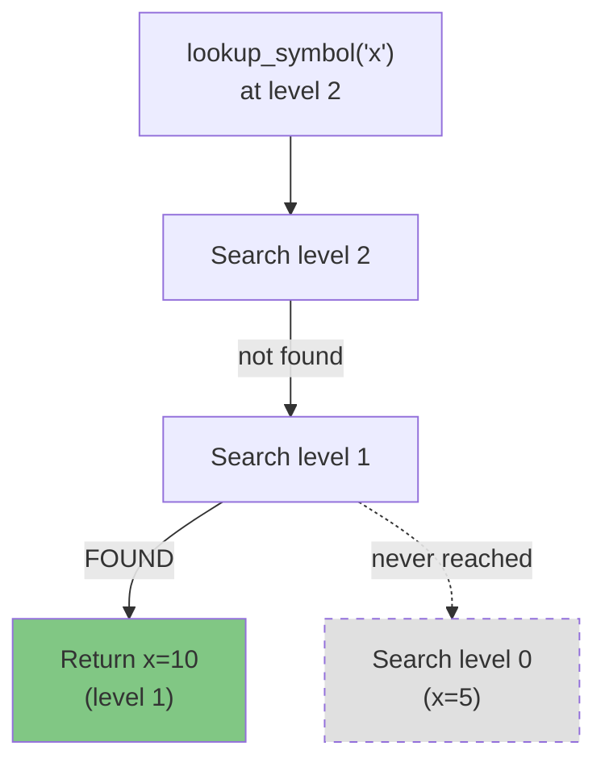

When looking up "x" at level 2:
1. Search level 2: Not found
2. Search level 1: **Found** x (value 10) → Return this
3. Never reaches level 0 (because already found)

**Return NULL**: Symbol not found in any scope

---

### Lookup Symbol in Specific Scope

```c
// Lookup in a specific scope - O(1) average case
symbol_node_t* lookup_symbol_in_scope(char* name, int scope_level) {
    unsigned int hash_index = hash(name);
    symbol_node_t* current = sym_table.hash_table[hash_index];

    while (current != NULL) {
        if (strcmp(current->name, name) == 0 && current->scope_level == scope_level) {
            return current;
        }
        current = current->hash_next;
    }

    return NULL;
}
```

**Purpose**: Check for duplicates in **exact** scope (no shadowing)

**Difference from `lookup_symbol`**:
- **No scope loop**: Only checks specified level
- Used by `add_symbol_with_attrs` to detect duplicates
- Simpler logic: single while loop

**Use Case**:
```c
{
    int x = 5;
    int x = 10;  // ERROR: Duplicate in SAME scope
}
```
- `lookup_symbol("x")` would find first x (correct)
- `lookup_symbol_in_scope("x", current_level)` also finds it
- Can report error: "already declared in current scope"

---

### Enter Scope

```c
void enter_scope() {
    sym_table.current_scope_level++;
    printf("SCOPE: Entering scope level %d\n", sym_table.current_scope_level);
}
```

**Purpose**: Track entering a new block/scope

**When called**: Parser sees `{`
- Increments scope depth
- All subsequent symbols added at this new level
- Enables nested scoping

**Example**:
```c
int x = 1;           // Level 0
{                    // enter_scope() -> Level 1
    int y = 2;       // Level 1
    {                // enter_scope() -> Level 2
        int z = 3;   // Level 2
    }
}
```

---

### Exit Scope

This is a **complex function** that cleans up symbols when leaving a scope.

```c
void exit_scope() {
    printf("SCOPE: Exiting scope level %d\n", sym_table.current_scope_level);

    // Remove symbols from current scope - iterate carefully to avoid corruption
    symbol_node_t* current = sym_table.head;
    symbol_node_t* next_node;

    while (current != NULL) {
        next_node = current->next;  // Save next pointer before potential deletion
```

**Setup**:
- Traverse global linked list (not hash table)
- **Critical**: Save `next` pointer before deletion
- Why? Deleting current invalidates `current->next`

#### Main Loop: Find and Delete Symbols

```c
        if (current->scope_level == sym_table.current_scope_level) {
            printf("SYMBOL TABLE: Removing '%s' from scope level %d\n",
                   current->name, current->scope_level);
```

**Condition**: Symbol belongs to scope being exited
- Only delete matching scope level
- Preserve symbols from outer scopes

#### Sub-step 1: Remove from Hash Table

```c
            // Remove from hash table - find it in the chain
            unsigned int hash_index = hash(current->name);
            symbol_node_t* hash_current = sym_table.hash_table[hash_index];
            symbol_node_t* hash_prev = NULL;

            while (hash_current != NULL) {
                if (hash_current == current) {
                    if (hash_prev == NULL) {
                        // First in hash chain
                        sym_table.hash_table[hash_index] = hash_current->hash_next;
                    } else {
                        // Middle or end of hash chain
                        hash_prev->hash_next = hash_current->hash_next;
                    }
                    break;
                }
                hash_prev = hash_current;
                hash_current = hash_current->hash_next;
            }
```

**Algorithm**: Remove from singly-linked list (hash chain)

**Two cases**:

**Case 1: Symbol is first in chain** (`hash_prev == NULL`)

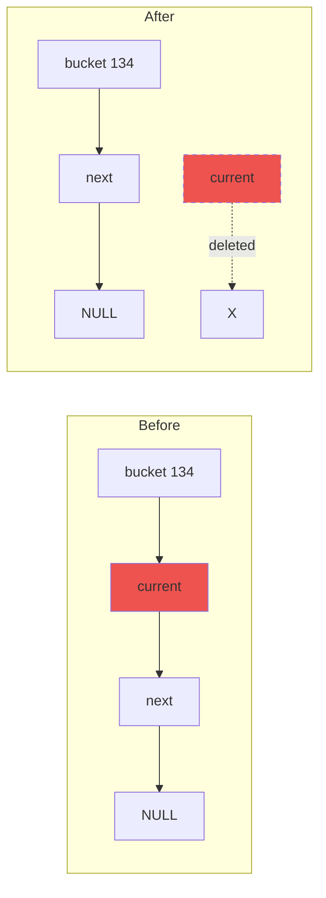

- Update bucket head directly

**Case 2: Symbol is in middle/end** (`hash_prev != NULL`)

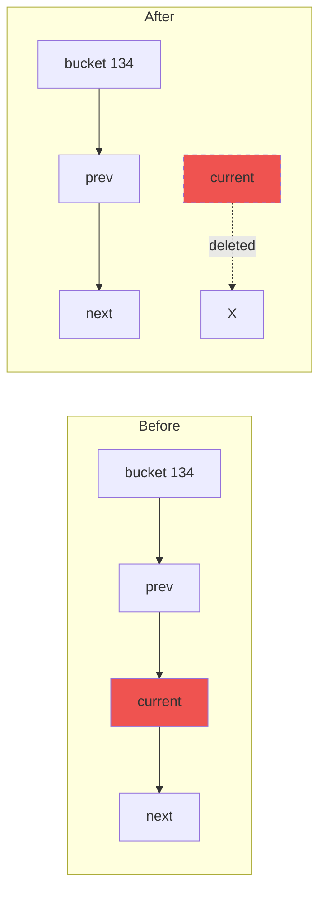

- Bypass current by linking prev to next

#### Sub-step 2: Remove from Global Linked List

```c
            // Remove from global linked list
            if (current->prev != NULL) {
                current->prev->next = current->next;
            } else {
                // This is the head
                sym_table.head = current->next;
            }

            if (current->next != NULL) {
                current->next->prev = current->prev;
            } else {
                // This is the tail
                sym_table.tail = current->prev;
            }
```

**Algorithm**: Remove from doubly-linked list

**Four cases to handle**:

**1. Middle node** (has prev and next):


**2. Head node** (no prev):
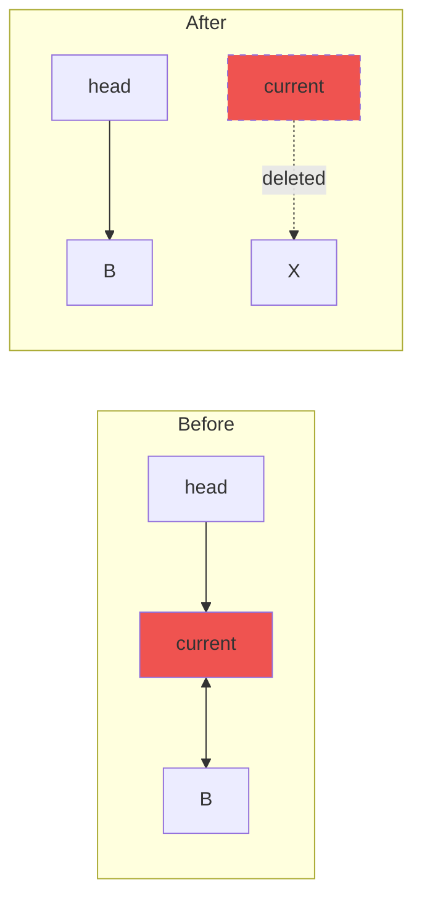

**3. Tail node** (no next):
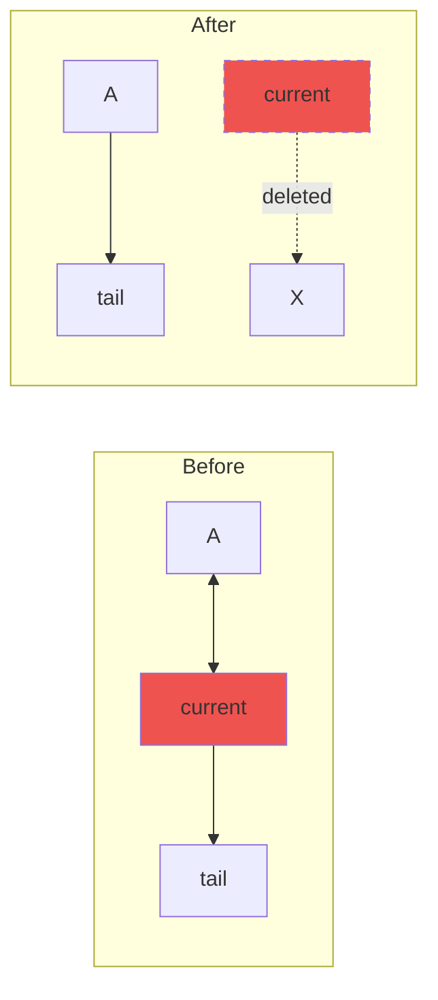

**4. Only node** (no prev or next):
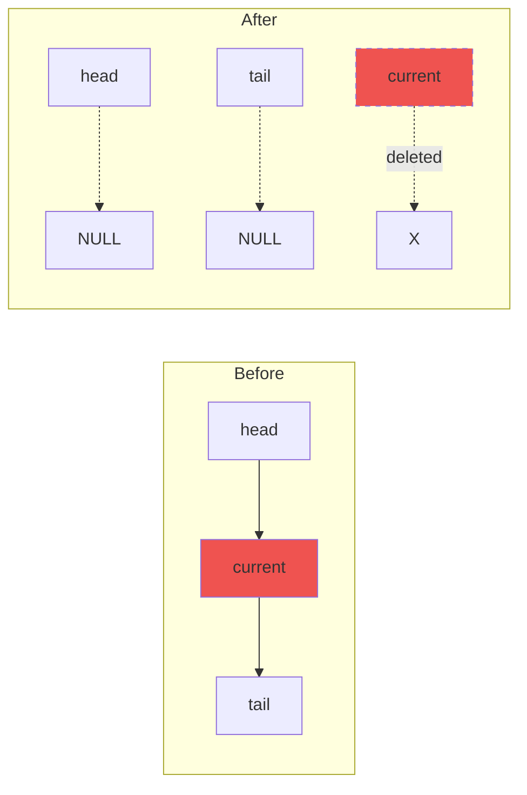

#### Sub-step 3: Free Memory

```c
            free(current);
            sym_table.count--;
        }

        current = next_node;
    }
```

**Cleanup**:
- `free(current)`: Release memory back to OS
- `sym_table.count--`: Update total count
- `current = next_node`: Move to next symbol (saved earlier!)

#### Final Step: Decrement Scope Level

```c
    if (sym_table.current_scope_level > 0) {
        sym_table.current_scope_level--;
    }
}
```

**Safety check**: Don't go below 0 (global scope)
- Prevents underflow from mismatched scope calls
- Global scope persists throughout compilation

**Example Execution**:
```c
{                    // enter_scope() -> level 1
    int x = 5;       // Add x at level 1
    int y = 10;      // Add y at level 1
}                    // exit_scope() -> removes x and y, back to level 0
```

---

### Print Symbol Table

```c
void print_symbol_table() {
    printf("\n=== SYMBOL TABLE (Linked List Implementation) ===\n");
    printf("%-15s %-12s %-12s %-8s %-8s %-10s %-10s\n", 
           "Name", "Type", "Scope", "Level", "Line", "Function", "Array/Ptr");
    printf("---------------------------------------------------------------------------------\n");
    
    symbol_node_t* current = sym_table.head;
    while (current != NULL) {
        char extra_info[20] = "";
        if (current->is_array) {
            if (current->array_size > 0) {
                sprintf(extra_info, "Array[%d]", current->array_size);
            } else {
                sprintf(extra_info, "Array[]");
            }
        } else if (current->is_pointer) {
            sprintf(extra_info, "Pointer");
        } else {
            sprintf(extra_info, "-");
        }
        
        printf("%-15s %-12s %-12s %-8d %-8d %-10s %-10s\n",
               current->name,
               type_to_string(current->type),
               scope_to_string(current->scope),
               current->scope_level,
               current->line_declared,
               current->is_function ? "Yes" : "No",
               extra_info);
        
        current = current->next;
    }
    printf("---------------------------------------------------------------------------------\n");
    printf("Total symbols: %d | Hash table size: %d\n\n", sym_table.count, HASH_TABLE_SIZE);
}
```

**Purpose**: Display all symbols in tabular format

**Key Points**:

1. **Uses global linked list** (not hash table)
   - Preserves insertion order
   - Easier to read for humans

2. **Formatted output**: `printf` with field width specifiers
   - `%-15s`: Left-align, 15 chars wide
   - Creates aligned columns

3. **Extra info logic**:
   - Arrays: Show size if known, else "Array[]"
   - Pointers: Show "Pointer"
   - Others: Show "-"

4. **Example Output**:
   ```
   === SYMBOL TABLE (Linked List Implementation) ===
   Name            Type         Scope        Level    Line     Function   Array/Ptr
   ---------------------------------------------------------------------------------
   x               int          global       0        1        No         -
   arr             int[]        global       0        2        No         Array[10]
   ptr             int*         global       0        3        No         Pointer
   main            int          global       0        5        Yes        -
   ---------------------------------------------------------------------------------
   Total symbols: 4 | Hash table size: 211
   ```

---

### Utility Functions

#### Type to String

```c
char* type_to_string(data_type_t type) {
    switch (type) {
        case TYPE_INT: return "int";
        case TYPE_FLOAT: return "float";
        case TYPE_CHAR: return "char";
        case TYPE_VOID: return "void";
        case TYPE_INT_PTR: return "int*";
        case TYPE_FLOAT_PTR: return "float*";
        case TYPE_CHAR_PTR: return "char*";
        case TYPE_INT_ARRAY: return "int[]";
        case TYPE_FLOAT_ARRAY: return "float[]";
        case TYPE_CHAR_ARRAY: return "char[]";
        default: return "unknown";
    }
}
```

**Purpose**: Convert enum to human-readable string
- Used in print statements
- **Returns string literal** (static storage, no free needed)
- Default case handles invalid/future types

#### Scope to String

```c
char* scope_to_string(scope_type_t scope) {
    switch (scope) {
        case SCOPE_GLOBAL: return "global";
        case SCOPE_FUNCTION: return "function";
        case SCOPE_BLOCK: return "block";
        default: return "unknown";
    }
}
```

**Purpose**: Convert scope enum to string
- Similar pattern to `type_to_string`
- Used for debugging and display

#### Is Variable Declared

```c
int is_variable_declared(char* name) {
    symbol_node_t* sym = lookup_symbol(name);
    return (sym != NULL);
}
```

**Purpose**: Boolean check for existence
- Wrapper around `lookup_symbol`
- Returns 1 (true) if found, 0 (false) if not
- Used in semantic analysis to catch undeclared variables

---

### Type Checking Functions

#### Are Types Compatible

```c
int are_types_compatible(data_type_t type1, data_type_t type2) {
    if (type1 == type2) return 1;
    
    // Get base types for comparison
    data_type_t base1 = get_base_type(type1);
    data_type_t base2 = get_base_type(type2);
    
    // Numeric promotions: int and char are compatible
    if ((base1 == TYPE_INT || base1 == TYPE_CHAR) && 
        (base2 == TYPE_INT || base2 == TYPE_CHAR)) return 1;
    
    // Float is only compatible with float
    if (base1 == TYPE_FLOAT && base2 == TYPE_FLOAT) return 1;
    
    return 0;
}
```

**Purpose**: Check if two types can be used together in expressions

**Rules Implemented**:

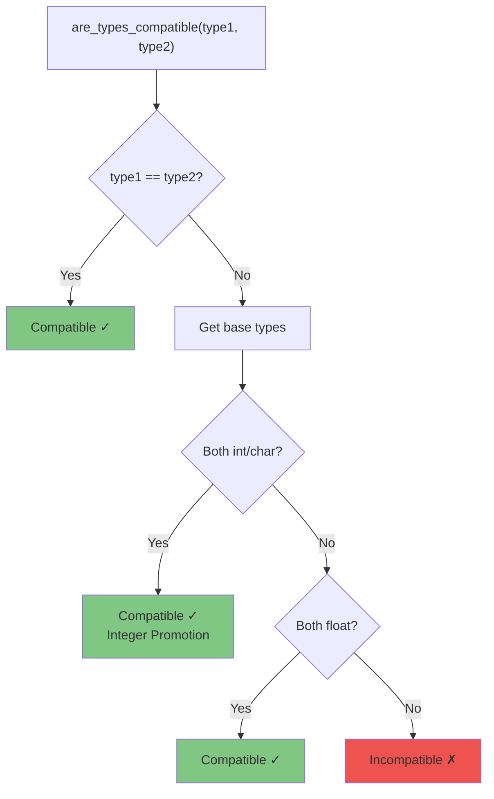

1. **Exact match**: `int` and `int` → Compatible
2. **Integer promotion**: `int` and `char` → Compatible
   - C allows: `int x = 'A' + 5;` (char promoted to int)
3. **Pointer/array to base**: `int[]` and `int*` → Compatible
   - Arrays decay to pointers in expressions
4. **Float isolation**: `float` only with `float`
   - Mixing float with int requires explicit cast

**Example Usage**:
```c
int x = 5;
char c = 'A';
float f = 3.14;

x + c;   // OK: are_types_compatible(TYPE_INT, TYPE_CHAR) = 1
x + f;   // ERROR: are_types_compatible(TYPE_INT, TYPE_FLOAT) = 0
```

#### Get Base Type

```c
data_type_t get_base_type(data_type_t type) {
    switch (type) {
        case TYPE_INT_PTR:
        case TYPE_INT_ARRAY:
            return TYPE_INT;
        case TYPE_FLOAT_PTR:
        case TYPE_FLOAT_ARRAY:
            return TYPE_FLOAT;
        case TYPE_CHAR_PTR:
        case TYPE_CHAR_ARRAY:
            return TYPE_CHAR;
        default:
            return type;
    }
}
```

**Purpose**: Extract underlying type from pointer/array
- `int*` → `int`
- `float[]` → `float`
- `char` → `char` (no change)

**Why needed?**
- Simplifies type comparisons
- Treats `int`, `int*`, and `int[]` as related

#### Is Array Type

```c
int is_array_type(data_type_t type) {
    return (type == TYPE_INT_ARRAY || type == TYPE_FLOAT_ARRAY || type == TYPE_CHAR_ARRAY);
}
```

**Purpose**: Boolean check for array types
- Used to enforce array-specific rules
- Example: Can't assign to entire array

#### Is Pointer Type

```c
int is_pointer_type(data_type_t type) {
    return (type == TYPE_INT_PTR || type == TYPE_FLOAT_PTR || type == TYPE_CHAR_PTR);
}
```

**Purpose**: Boolean check for pointer types
- Used for pointer arithmetic validation
- Example: `ptr + 1` allowed, `arr + 1` also allowed

#### Is Numeric Type

```c
int is_numeric_type(data_type_t type) {
    data_type_t base = get_base_type(type);
    return (base == TYPE_INT || base == TYPE_FLOAT || base == TYPE_CHAR);
}
```

**Purpose**: Check if type can be used in arithmetic
- Gets base type first (handle pointers/arrays)
- Returns true for int, float, char
- Returns false for void

**Example**:
```c
int arr[10];
is_numeric_type(TYPE_INT_ARRAY);  // Returns 1 (base is int)

void* ptr;
is_numeric_type(TYPE_VOID);       // Returns 0 (can't do math on void)
```

---

## Key Algorithms

### Hash Table with Chaining

**Collision Resolution**: Separate chaining (linked lists)

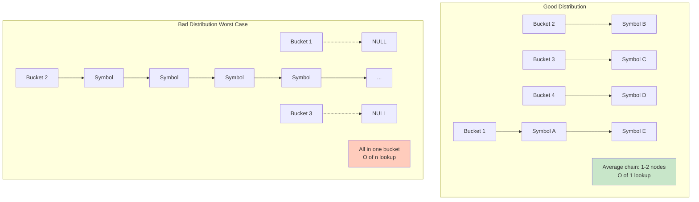

**Advantages**:
- ✅ Simple to implement
- ✅ No clustering issues
- ✅ Handles many collisions gracefully
- ✅ Easy deletion

**Disadvantages**:
- ❌ Extra memory for pointers
- ❌ Poor cache locality
- ❌ Degrades to O(n) if all hash to same bucket

**Load Factor**: α = n / m
- n = number of symbols
- m = table size (211)
- With good hash, average chain length ≈ α
- Expected lookup time: O(1 + α)

### Scope Management

**Stack-based scope tracking**:
- Scope level = depth in nesting
- Enter scope: Push (increment level)
- Exit scope: Pop (decrement level, delete symbols)

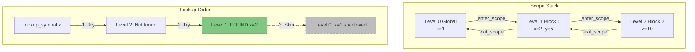

**Shadowing**: Inner scopes hide outer scopes
```c
int x = 1;     // Level 0
{
    int x = 2; // Level 1 (shadows level 0)
    // "x" refers to level 1 version
}
// "x" refers to level 0 version again
```

**Implementation**: `lookup_symbol` searches from high to low level

### Doubly-Linked List

**Purpose**: Maintain all symbols in insertion order

**Operations**:
- **Append**: O(1) with tail pointer
- **Delete**: O(1) if have node pointer
- **Traverse**: O(n) sequential access

**Why doubly-linked?**
- Delete needs to update previous node
- Singly-linked would require O(n) to find previous

---

## Examples and Use Cases

### Example 1: Simple Variable Declaration

**Source Code**:
```c
int x = 5;
```

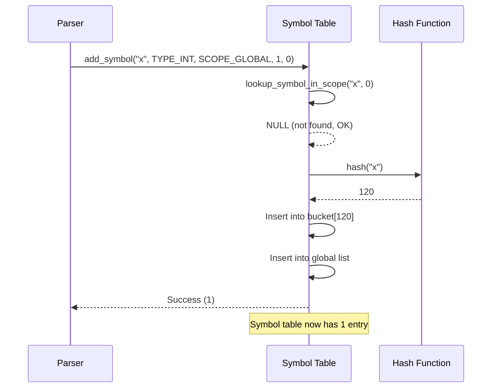

**Symbol Table Operations**:
1. Parser sees "int x"
2. Calls: `add_symbol("x", TYPE_INT, SCOPE_GLOBAL, 1, 0)`
3. Checks: `lookup_symbol_in_scope("x", 0)` → NULL (OK)
4. Computes: `hash("x")` → e.g., 120
5. Inserts into bucket 120 and global list
6. Result: Symbol table has 1 entry

### Example 2: Nested Scopes

**Source Code**:
```c
int x = 1;
{
    int y = 2;
    {
        int z = 3;
    }
}
```

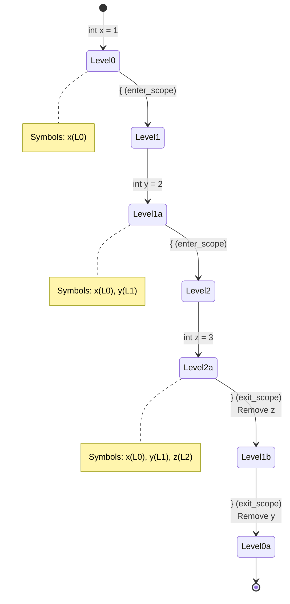

**Symbol Table Timeline**:

| Action | Scope Level | Symbols Present |
|--------|-------------|-----------------|
| `int x = 1` | 0 | x(L0) |
| `{` (first) | 1 | x(L0) |
| `int y = 2` | 1 | x(L0), y(L1) |
| `{` (second) | 2 | x(L0), y(L1) |
| `int z = 3` | 2 | x(L0), y(L1), z(L2) |
| `}` (second) | 1 | x(L0), y(L1) |
| `}` (first) | 0 | x(L0) |

### Example 3: Shadowing

**Source Code**:
```c
int x = 1;
{
    int x = 2;  // Different x
    printf("%d", x);  // Prints 2
}
printf("%d", x);  // Prints 1
```

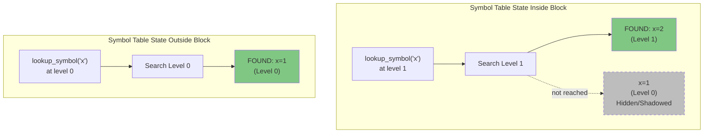

**Lookup Behavior**:
- Inside inner block:
  - `lookup_symbol("x")` searches level 1 → finds x=2
- Outside inner block:
  - `lookup_symbol("x")` searches level 0 → finds x=1

### Example 4: Type Checking

**Source Code**:
```c
int x = 5;
float f = 3.14;
int result = x + f;  // Type error!
```

```mermaid
sequenceDiagram
    participant Parser
    participant SymTable as Symbol Table
    participant TypeChecker as Type Checker
    
    Parser->>SymTable: lookup_symbol("x")
    SymTable-->>Parser: TYPE_INT
    
    Parser->>SymTable: lookup_symbol("f")
    SymTable-->>Parser: TYPE_FLOAT
    
    Parser->>TypeChecker: are_types_compatible(TYPE_INT, TYPE_FLOAT)
    TypeChecker->>TypeChecker: Check exact match: No
    TypeChecker->>TypeChecker: Get base types: int, float
    TypeChecker->>TypeChecker: Check int/char promotion: No
    TypeChecker->>TypeChecker: Check both float: No
    TypeChecker-->>Parser: 0 (Incompatible)
    
    Parser->>Parser: Report Error ❌
    Note over Parser: "Incompatible types in expression"
```

**Type Checking Process**:
1. Lookup `x` → TYPE_INT
2. Lookup `f` → TYPE_FLOAT
3. Check: `are_types_compatible(TYPE_INT, TYPE_FLOAT)` → 0
4. Report error: "Incompatible types in expression"

### Example 5: Arrays and Pointers

**Source Code**:
```c
int arr[10];
int* ptr = arr;
```

**Symbol Table Entries**:
```
Name  Type      Array Size  Pointer
----  ----      ----------  -------
arr   int[]     10          0
ptr   int*      0           1
```

**Type Checking**:
- `arr` → TYPE_INT_ARRAY
- `ptr` → TYPE_INT_PTR
- `get_base_type(TYPE_INT_ARRAY)` → TYPE_INT
- `get_base_type(TYPE_INT_PTR)` → TYPE_INT
- Compatible for assignment

---

## Performance Analysis

### Time Complexity

| Operation | Average Case | Worst Case |
|-----------|--------------|------------|
| `add_symbol` | O(1) | O(n) |
| `lookup_symbol` | O(1) | O(n) |
| `lookup_symbol_in_scope` | O(1) | O(n) |
| `exit_scope` | O(n) | O(n) |
| `print_symbol_table` | O(n) | O(n) |

**Notes**:
- Worst case: All symbols hash to same bucket (rare with good hash)
- `exit_scope`: Must traverse all symbols to find ones to delete

### Space Complexity

**Total Space**: O(n + m)
- n = number of symbols
- m = hash table size (211)

**Per Symbol**: ~100 bytes
- Fixed fields: ~60 bytes
- String (32 chars): 32 bytes
- Pointers (3): 24 bytes (64-bit system)

**Example**: 1000 symbols ≈ 100 KB

---

## Design Patterns Used

### 1. **Flyweight Pattern**
- Shared string literals in `type_to_string` and `scope_to_string`
- Reduces memory for repeated strings

### 2. **Iterator Pattern**
- Global linked list enables sequential traversal
- Used in `print_symbol_table` and `exit_scope`

### 3. **Factory Pattern** (implicit)
- `add_symbol_with_attrs` creates and configures symbol nodes
- Encapsulates construction logic

### 4. **Strategy Pattern** (type checking)
- Different compatibility rules per type
- Extensible for new types

---

## Potential Improvements

### 1. **Dynamic Resizing**
- Currently fixed at 211 buckets
- Could grow/shrink based on load factor
- Trade-off: complexity vs. performance

### 2. **Scope Stack Data Structure**
- Currently use levels (0, 1, 2, ...)
- Could use explicit stack of symbol lists
- Faster scope exit (no traversal needed)

### 3. **Red-Black Tree for Each Scope**
- Replace hash table with balanced BST
- Guarantees O(log n) worst case
- Trade-off: slower average case

### 4. **String Interning**
- Store unique strings once
- Symbol nodes hold pointers, not copies
- Saves memory for duplicate names

### 5. **Separate Type System**
- Extract type checking to separate module
- Symbol table focuses on storage/lookup
- Better separation of concerns

---

## Conclusion

This symbol table implementation is a **production-quality** design suitable for a complete compiler. It combines:

```mermaid
graph TB
    ROOT["Symbol Table Implementation"]
    
    ROOT --> DS[Data Structures]
    ROOT --> FEAT[Features]
    ROOT --> QUAL[Quality]
    
    DS --> HT[Hash Table]
    DS --> LL[Doubly-Linked List]
    
    HT --> HT1[211 Buckets]
    HT --> HT2[O of 1 Lookup]
    HT --> HT3[Chaining]
    
    LL --> LL1[Insertion Order]
    LL --> LL2[Easy Traversal]
    LL --> LL3[O of 1 Delete]
    
    FEAT --> SC[Scoping]
    FEAT --> TS[Type System]
    FEAT --> OP[Operations]
    
    SC --> SC1[Nested Scopes]
    SC --> SC2[Shadowing]
    SC --> SC3[Stack-based]
    
    TS --> TS1[Basic Types]
    TS --> TS2[Pointers]
    TS --> TS3[Arrays]
    TS --> TS4[Functions]
    
    OP --> OP1[Add Symbol]
    OP --> OP2[Lookup]
    OP --> OP3[Type Checking]
    OP --> OP4[Scope Enter/Exit]
    
    QUAL --> Q1[Fast O of 1 avg]
    QUAL --> Q2[Memory Efficient]
    QUAL --> Q3[Robust Errors]
    QUAL --> Q4[Production Ready]
    
    style ROOT fill:#e1f5ff
    style DS fill:#fff3e0
    style FEAT fill:#f3e5f5
    style QUAL fill:#c8e6c9
```

✅ **Fast lookup** via hashing  
✅ **Ordered traversal** via linked list  
✅ **Proper scoping** with nesting support  
✅ **Rich type system** with arrays, pointers, functions  
✅ **Robust error handling** for duplicates  
✅ **Memory management** with careful deletion  

The hybrid structure (hash table + linked list) is a common pattern in compiler construction, balancing speed and functionality. The implementation handles the complex cases (shadowing, scope exit, type compatibility) correctly, making it a solid foundation for a C-like language compiler.
