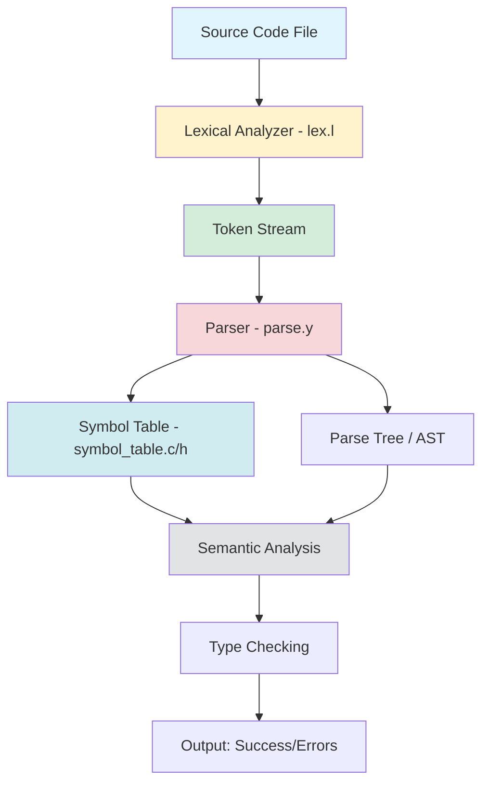
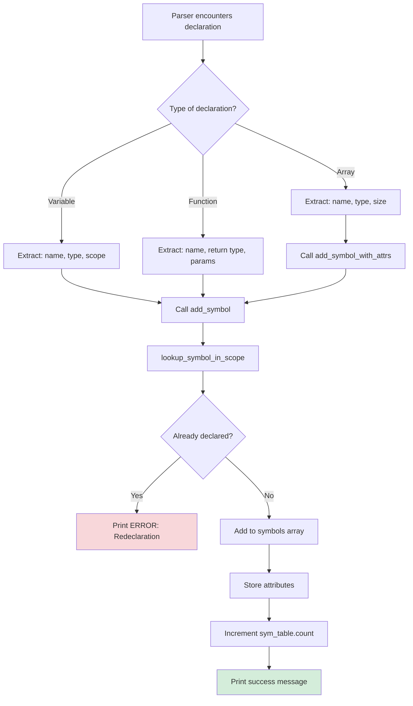
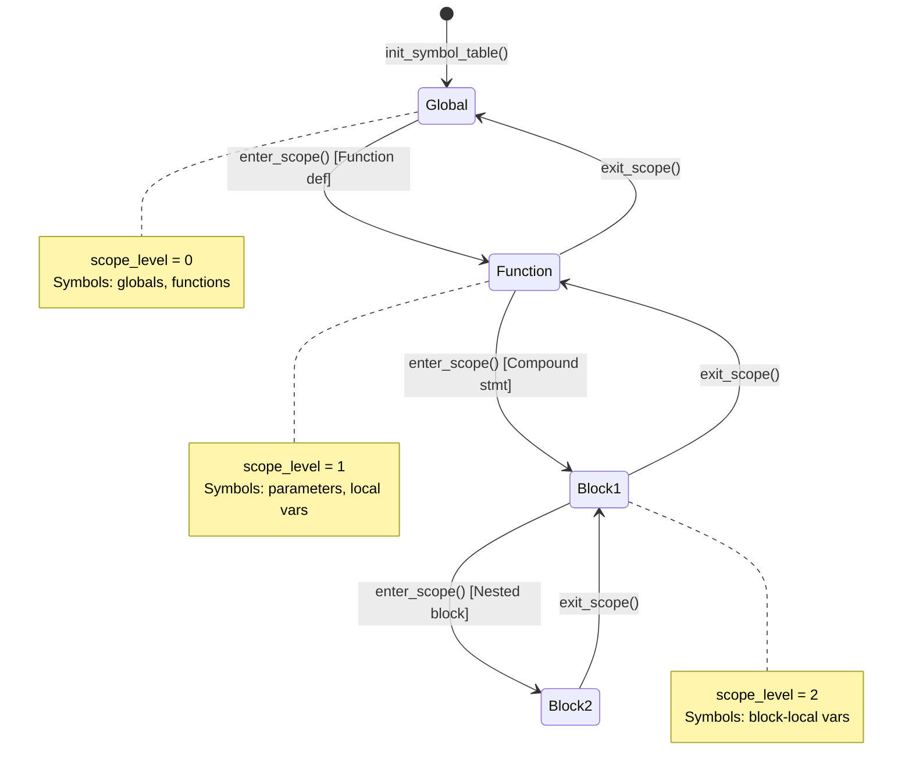
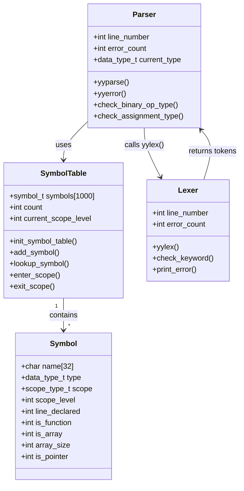

# Interaction Between Lexical Analyzer, Parser, and Symbol Table

## Overview

In a compiler, three critical components work together to analyze source code:

1. **Lexical Analyzer (Lexer)** - Breaks source code into tokens
2. **Syntax Analyzer (Parser)** - Validates grammatical structure and builds parse trees
3. **Symbol Table** - Stores and manages information about identifiers

Let me explain their interaction with detailed diagrams and explanations.

## 1. High-Level Architecture



**Explanation:**

- **Source Code** enters the **Lexical Analyzer** first
- The lexer converts text into **tokens** (identifiers, keywords, operators, etc.)
- The **Parser** receives tokens and validates syntax according to grammar rules
- During parsing, the parser **interacts with the Symbol Table** to:
  - Add new symbol declarations
  - Look up symbols for type checking
  - Manage scope levels
- **Type checking** happens during parsing using symbol table information

---

## 2. Detailed Token Flow

```mermaid
sequenceDiagram
    participant SC as Source Code
    participant LEX as Lexer (lex.l)
    participant TOK as Token Stream
    participant PAR as Parser (parse.y)
    participant SYM as Symbol Table
    
    SC->>LEX: Read character stream
    LEX->>LEX: Pattern matching with regex
    LEX->>LEX: check_keyword("int")
    LEX->>TOK: Generate INT_TOK
    TOK->>PAR: yylex() returns INT_TOK
    
    SC->>LEX: Read "x"
    LEX->>LEX: Match [a-zA-Z_][a-zA-Z0-9_]*
    LEX->>TOK: Generate ID_TOK, yylval.string_val = "x"
    TOK->>PAR: yylex() returns ID_TOK
    
    PAR->>PAR: Match rule: data_type declarator
    PAR->>SYM: add_symbol("x", TYPE_INT, ...)
    SYM->>SYM: Check for duplicates
    SYM->>PAR: Success/Failure
    
    SC->>LEX: Read ";"
    LEX->>TOK: Generate SEMICOLON_TOK
    TOK->>PAR: Complete declaration rule
    PAR->>PAR: print_syntax_success()
```

**Step-by-Step Explanation:**

1. **Lexer reads characters**: `int x;`
2. **Pattern matching**: 
   - "int" matches `{letter}{alphanum}*` → calls `check_keyword()` → returns `INT_TOK`
   - "x" matches `{letter}{alphanum}*` → returns `ID_TOK` with `yylval.string_val = "x"`
   - ";" matches `";"` → returns `SEMICOLON_TOK`

3. **Parser receives tokens**:
   - Matches grammar rule: `data_type declarator SEMICOLON_TOK`
   - Triggers action: Add "x" to symbol table with type INT

4. **Symbol Table interaction**:
   - Checks if "x" already exists in current scope
   - If not, adds new entry with attributes

---

## 3. Symbol Table Operations During Parsing



**Detailed Explanation:**

When the parser encounters a declaration like `int x, y[10];`:

1. **Parser recognizes pattern**: `data_type declarator_list SEMICOLON_TOK`
2. **Sets current_type**: `current_type = TYPE_INT` 
3. **For each declarator**:
   - **Simple variable "x"**: Calls `add_symbol("x", TYPE_INT, SCOPE_GLOBAL, line_number, 0)`
   - **Array "y[10]"**: Calls `add_symbol_with_attrs("y", TYPE_INT_ARRAY, SCOPE_GLOBAL, line_number, 0, 1, 10, 0)`

4. **Symbol Table processing**:
   - Calls `lookup_symbol_in_scope()` to check for duplicates
   - If duplicate → returns 0, parser increments error_count
   - If new → stores in `sym_table.symbols[]` array

---

## 4. Scope Management



**Scope Lifecycle:**

```c
// Parser grammar rule for compound statement
compound_statement: LBRACE_TOK 
                    { enter_scope(); }    // ← Scope level++
                    statement_list 
                    RBRACE_TOK
                    { exit_scope(); }     // ← Remove symbols, Scope level--
```

**What happens during enter_scope():**
```c
void enter_scope() {
    sym_table.current_scope_level++;  // Increment level
    printf("SCOPE: Entering scope level %d\n", sym_table.current_scope_level);
}
```

**What happens during exit_scope():**
```c
void exit_scope() {
    // Remove all symbols with scope_level == current_scope_level
    for (int i = 0; i < sym_table.count; i++) {
        if (sym_table.symbols[i].scope_level == sym_table.current_scope_level) {
            // Remove this symbol (shift array)
        }
    }
    sym_table.current_scope_level--;  // Decrement level
}
```

---

## 5. Type Checking with Symbol Table

```mermaid
sequenceDiagram
    participant SRC as Source: x + y
    participant LEX as Lexer
    participant PAR as Parser
    participant SYM as Symbol Table
    participant TC as Type Checker
    
    SRC->>LEX: "x"
    LEX->>PAR: ID_TOK("x")
    PAR->>SYM: lookup_symbol("x")
    SYM->>PAR: Return symbol {type: TYPE_INT, ...}
    PAR->>TC: Left operand type = TYPE_INT
    
    SRC->>LEX: "+"
    LEX->>PAR: ADD_TOK
    
    SRC->>LEX: "y"
    LEX->>PAR: ID_TOK("y")
    PAR->>SYM: lookup_symbol("y")
    SYM->>PAR: Return symbol {type: TYPE_FLOAT, ...}
    PAR->>TC: Right operand type = TYPE_FLOAT
    
    TC->>TC: check_binary_op_type(TYPE_INT, TYPE_FLOAT, "+")
    TC->>TC: are_types_compatible(TYPE_INT, TYPE_FLOAT)
    TC->>TC: is_numeric_type() for both
    TC->>PAR: Result type = TYPE_FLOAT (promotion)
    PAR->>PAR: Set expression type = TYPE_FLOAT
```

**Type Checking Process:**

1. **Variable lookup**: When parser encounters `ID_TOK`, it calls `lookup_symbol()` to retrieve type information
2. **Type extraction**: Parser gets `data_type_t` from symbol table entry
3. **Type compatibility check**: For binary operations, parser calls `check_binary_op_type()`
4. **Type promotion**: If int and float → result is float
5. **Error reporting**: If incompatible types → `print_type_error()`

---

## 6. Complete Interaction Example

Let's trace: `int x; float y; x = y + 5;`

```mermaid
graph TB
    subgraph "Phase 1: Declaration of x"
        A1[Lexer: int] --> A2[INT_TOK]
        A3[Lexer: x] --> A4[ID_TOK with yylval='x']
        A5[Lexer: ;] --> A6[SEMICOLON_TOK]
        A2 --> A7[Parser: data_type rule]
        A4 --> A8[Parser: declarator rule]
        A6 --> A9[Parser: complete declaration]
        A9 --> A10[Symbol Table: add_symbol 'x' TYPE_INT GLOBAL]
    end
    
    subgraph "Phase 2: Declaration of y"
        B1[Lexer: float] --> B2[FLOAT_TOK]
        B3[Lexer: y] --> B4[ID_TOK with yylval='y']
        B5[Lexer: ;] --> B6[SEMICOLON_TOK]
        B2 --> B7[Parser: data_type rule]
        B4 --> B8[Parser: declarator rule]
        B6 --> B9[Parser: complete declaration]
        B9 --> B10[Symbol Table: add_symbol 'y' TYPE_FLOAT GLOBAL]
    end
    
    subgraph "Phase 3: Assignment x = y + 5"
        C1[Lexer: x] --> C2[ID_TOK 'x']
        C2 --> C3[Parser: lookup_symbol 'x']
        C3 --> C4[Symbol Table: return TYPE_INT]
        
        C5[Lexer: y] --> C6[ID_TOK 'y']
        C6 --> C7[Parser: lookup_symbol 'y']
        C7 --> C8[Symbol Table: return TYPE_FLOAT]
        
        C9[Lexer: 5] --> C10[INTCONST_TOK]
        C10 --> C11[Type: TYPE_INT]
        
        C8 --> C12[check_binary_op_type: FLOAT + INT]
        C11 --> C12
        C12 --> C13[Result: TYPE_FLOAT]
        
        C4 --> C14[check_assignment_type: INT = FLOAT]
        C13 --> C14
        C14 --> C15[Type Error: Cannot assign FLOAT to INT]
    end
    
    style A10 fill:#d4edda
    style B10 fill:#d4edda
    style C15 fill:#f8d7da
```



**Execution Steps:**

1. **`int x;`**
   - Lexer: `INT_TOK` → `ID_TOK("x")` → `SEMICOLON_TOK`
   - Parser: Match declaration rule → `add_symbol("x", TYPE_INT, ...)`
   - Symbol Table: Add entry, count++

2. **`float y;`**
   - Lexer: `FLOAT_TOK` → `ID_TOK("y")` → `SEMICOLON_TOK`
   - Parser: Match declaration rule → `add_symbol("y", TYPE_FLOAT, ...)`
   - Symbol Table: Add entry, count++

3. **`x = y + 5;`**
   - Lexer: `ID_TOK("x")` → `ASSIGN_TOK` → `ID_TOK("y")` → `ADD_TOK` → `INTCONST_TOK(5)` → `SEMICOLON_TOK`
   - Parser: 
     - Lookup "x" → TYPE_INT
     - Lookup "y" → TYPE_FLOAT
     - Check `y + 5`: FLOAT + INT → Result TYPE_FLOAT
     - Check assignment: `TYPE_INT = TYPE_FLOAT` → **TYPE ERROR**

---

## 7. Data Structures



---

## 8. Key Interaction Points

| **Component** | **Responsibility** | **Interaction Point** |
|---------------|-------------------|----------------------|
| **Lexer** | Tokenization, keyword recognition, lexical error detection | Calls `check_keyword()`, returns tokens via `yylex()`, stores identifier names in `yylval.string_val` |
| **Parser** | Grammar validation, syntax tree building, semantic analysis | Calls `yylex()` to get tokens, calls symbol table functions during actions, performs type checking |
| **Symbol Table** | Stores identifier information, manages scopes, provides lookup | Called by parser during declarations (`add_symbol`) and references (`lookup_symbol`) |

## Conclusion

The three components work in a **pipeline** with **bidirectional communication** between Parser and Symbol Table:

1. **Lexer → Parser**: One-way token stream
2. **Parser ↔ Symbol Table**: Two-way communication for storage and retrieval
3. **Parser uses Symbol Table data** for semantic analysis and type checking

This architecture enables:
- **Separation of concerns**: Each component has a clear responsibility
- **Efficient lookup**: Symbol table provides O(n) lookup with scope chaining
- **Comprehensive error detection**: Lexical, syntactic, and semantic errors are caught at different stages
- **Type safety**: Symbol table stores type information used during semantic analysis