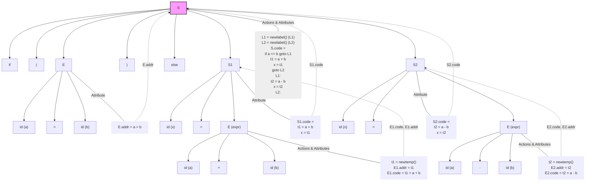

```mermaid
graph TD
    S["S"] --> IF["if"]
    S --> OP1["("]
    S --> E["E"]
    S --> CP1[")"]
    S --> S1["S1"]
    S --> ELSE["else"]
    S --> S2["S2"]

    %% Actions at Node S
    S -- "Actions & Attributes" --- SActions["L1 = newlabel() (L1)
L2 = newlabel() (L2)
S.code =
  if a <= b goto L1
  t1 = a + b
  x = t1
  goto L2
  L1:
  t2 = a - b
  x = t2
  L2:"]

    %% Subtree for E (Condition)
    E --> IDA["id (a)"]
    E --> GT[">"]
    E --> IDB["id (b)"]
    E -- "Attribute" --- EAttr["E.addr = a > b"]

    %% Subtree for S1 (Assignment 1)
    S1 --> IDX1["id (x)"]
    S1 --> EQ1["="]
    S1 --> E1["E (expr)"]
    S1 -- "Attribute" --- S1Attr["S1.code =
  t1 = a + b
  x = t1"]

    E1 --> IDA1["id (a)"]
    E1 --> PLUS["+"]
    E1 --> IDB1["id (b)"]
    E1 -- "Actions & Attributes" --- E1Attr["t1 = newtemp()
E1.addr = t1
E1.code = t1 = a + b"]

    %% Subtree for S2 (Assignment 2)
    S2 --> IDX2["id (x)"]
    S2 --> EQ2["="]
    S2 --> E2["E (expr)"]
    S2 -- "Attribute" --- S2Attr["S2.code =
  t2 = a - b
  x = t2"]

    E2 --> IDA2["id (a)"]
    E2 --> MINUS["-"]
    E2 --> IDB2["id (b)"]
    E2 -- "Actions & Attributes" --- E2Attr["t2 = newtemp()
E2.addr = t2
E2.code = t2 = a - b"]

    %% Attribute Flow (Visualization of synthesis)
    EAttr -.->|E.addr| S
    S1Attr -.->|S1.code| S
    S2Attr -.->|S2.code| S
    E1Attr -.->|E1.code, E1.addr| S1
    E2Attr -.->|E2.code, E2.addr| S2

    style S fill:#f9f,stroke:#333,stroke-width:2px
    style SActions fill:#eee,stroke:none
    style EAttr fill:#eef,stroke:none
    style S1Attr fill:#eef,stroke:none
    style S2Attr fill:#eef,stroke:none
    style E1Attr fill:#eef,stroke:none
    style E2Attr fill:#eef,stroke:none
```
